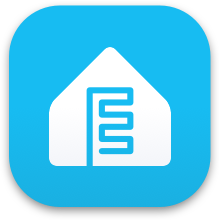

Our ESPHome Control4 Driver enables seamless integration between Control4 systems and ESPHome-powered devices, opening up a world of possibilities for your smart home setup.

With this driver, you can:

 - Control ESPHome devices directly from your Control4 interface
 - Create complex automation scenarios involving ESPHome sensors and actuators
 - Monitor device status and receive notifications
 - Expand your smart home capabilities with affordable DIY components

Open Source version can be found [here](https://github.com/finitelabs/control4-esphome).

Commercial version can be found [here](https://drivercentral.io/platforms/control4-drivers/utility/esphome/).