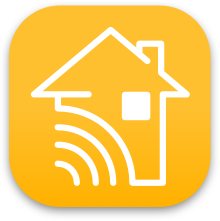

Our Home Connect for Apple Home Driver bridges the gap between Control4 and Apple HomeKit, allowing you to control your Control4 system using Apple's Home app and Siri.

Key features include:

 - Voice control of Control4 devices using Siri
 - Integration with Apple Home scenes and automations
 - Remote access to your Control4 system through the Apple Home app
 - Seamless experience for Apple users in Control4 environments

Open Source version can be found [here](https://github.com/finitelabs/homebridge-control4-home-connect).

Commercial version can be found [here](https://drivercentral.io/platforms/control4-drivers/utility/home-connect-for-apple-home/).